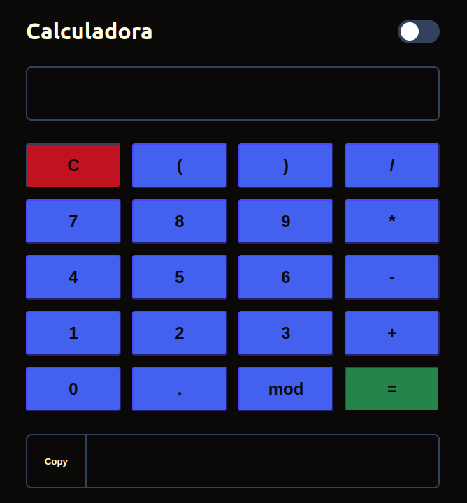
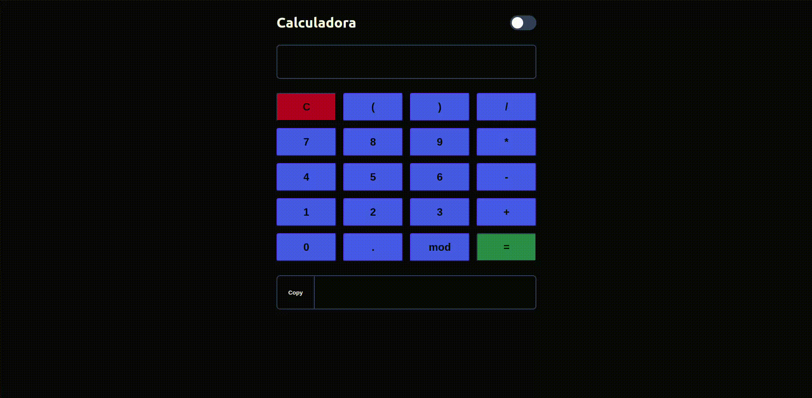

# Calculadora JS

# 

## 🤔 Proposta 

Calculadora que executa as 4 operações.

## 🛠️ Construído com

* HTML - Corpo 
* CSS - Estilo 
* Vanilla JS - Troca de tema e calculos

## 🖥️ Como ficou

    

## ✒️ Autor

* **Desenvolvedor** - *Trabalho e documentação* - [Willy F. Nascimento](https://github.com/will27nasc)

## 📄 Licença

Este projeto está sob a licença (will27nasc/Calculadora-js) - veja o arquivo [LICENSE.md](https://github.com/will27nasc/Calculadora-js/blob/main/LICENSE) para detalhes.

Visite o meu site [Calculadora JS](https://will27nasc.github.io/Calculadora-js/) 😊
